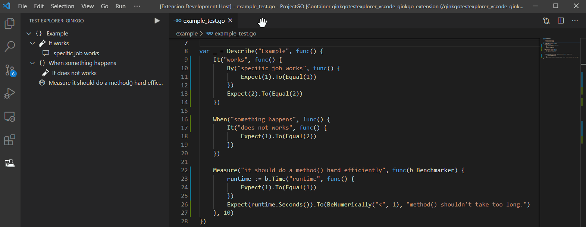

# Ginkgo Test Explorer for VS Code

This VS Code extension offers a set of tools for the [Ginkgo Framework](https://onsi.github.io/ginkgo/).



It is based on two other extensions:
- [GoTestExplorer](https://github.com/ppparihar/GoTestExplorer)
- [vscode-ginkgo-tools](https://github.com/dlipovetsky/vscode-ginkgo-tools)

## Requirements

### Golang

This package requires the Go programming language extension for language support. It also requires you to have golang installed on your machine. To install, follow these [instructions](https://golang.org/doc/install)

### Ginkgo

- Version: 1.15.0 or newer
- The extension does not include the gingko executable. To install, follow these [instructions](https://onsi.github.io/ginkgo/#getting-ginkgo).

Just `go get` it:

```bash
go get github.com/onsi/ginkgo/ginkgo
go get github.com/onsi/gomega/...
```

## License

[MIT](LICENSE "License")
