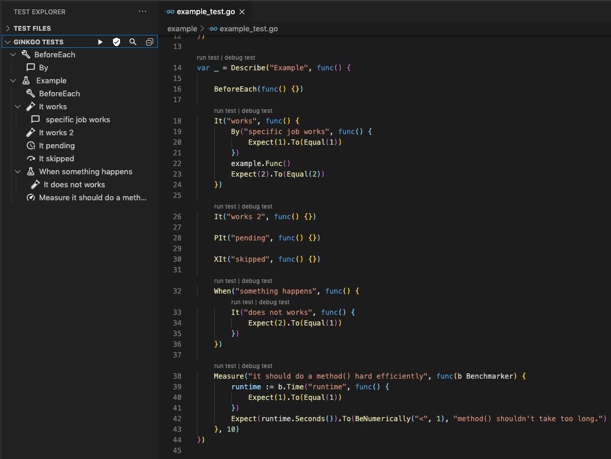
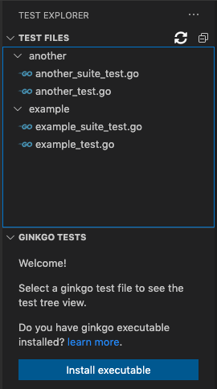
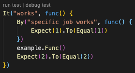
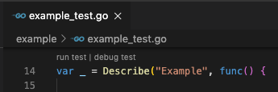
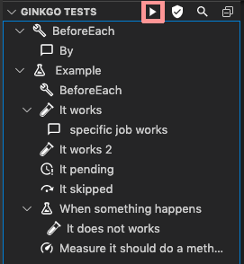
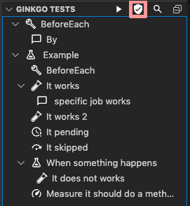
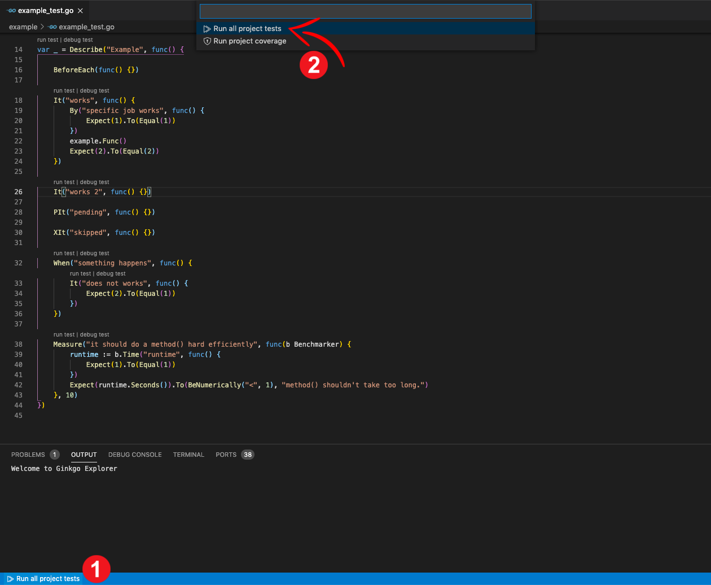
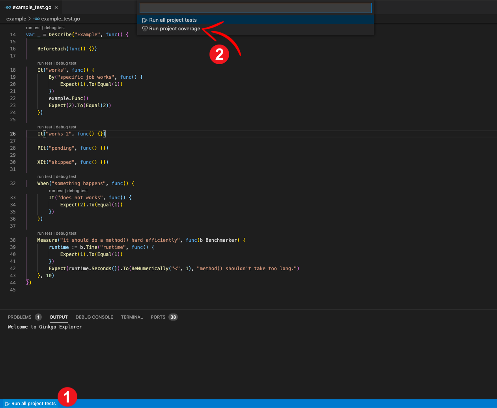
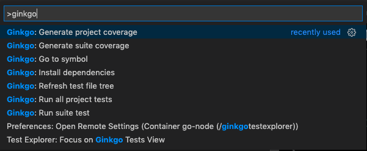

# Ginkgo Test Explorer for VS Code

<div align="center">

[](https://github.com/joselitofilho/ginkgoTestExplorer/releases/)
[](https://app.slack.com/client/T029RQSE6/C06TMUDMC5B)
[](https://www.buymeacoffee.com/joselitofilho)

</div>

Welcome!

This VS Code extension offers a set of tools for the [Ginkgo Framework](https://onsi.github.io/ginkgo/).


It is based on two other extensions:
- [GoTestExplorer](https://github.com/ppparihar/GoTestExplorer)
- [vscode-ginkgo-tools](https://github.com/dlipovetsky/vscode-ginkgo-tools)

## Requirements

### Golang

This package requires the Go programming language extension for language support. It also requires you to have golang installed on your machine. To install, follow these [instructions](https://golang.org/doc/install)

### Ginkgo

- Version: 1.15.0 or newer
- The extension does not include the gingko executable. To install, follow these [instructions](https://onsi.github.io/ginkgo/#getting-ginkgo).

Just `go get` it:

```bash
go get github.com/onsi/ginkgo/ginkgo
go get github.com/onsi/gomega/...
```

## Features

### View tests tree



### View test file tree



### Run/Debug individual test



### Run/Debug suite tests





### Generate suite coverage



### Run all project tests



### Generate project coverage



### Go to symbol in editor


### Command pallete

on Windows or Linux:
- Tap <kbd>ctrl</kbd> + <kbd>shift</kbd> + <kbd>p</kbd>

on MacOS:
- Tap <kbd>command</kbd> + <kbd>shift</kbd> + <kbd>p</kbd>



## License

[MIT](LICENSE "License")